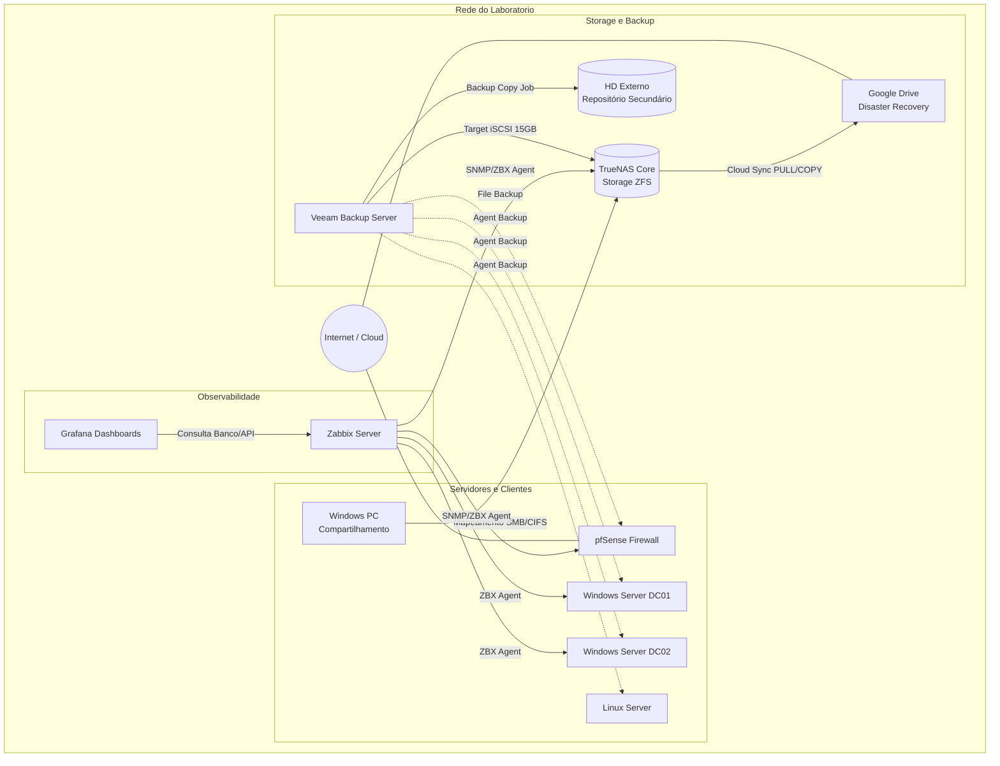

```mermaid
graph TD
    Internet((Internet / Cloud))
    GDrive[Google Drive <br> Disaster Recovery]
    Internet --- GDrive

    subgraph Rede do Laboratorio
        Firewall[pfSense Firewall]
        Internet --- Firewall

        subgraph Storage e Backup
            TrueNAS[(TrueNAS Core <br> Storage ZFS)]
            Veeam[Veeam Backup Server]
            ExtHDD[(HD Externo <br> Repositório Secundário)]
            
            TrueNAS -- Cloud Sync PULL/COPY --> GDrive
            Veeam -- Target iSCSI 15GB --> TrueNAS
            Veeam -- Backup Copy Job --> ExtHDD
        end

        subgraph Servidores e Clientes
            DC01[Windows Server DC01]
            DC02[Windows Server DC02]
            Linux[Linux Server]
            WinClient[Windows PC <br> Compartilhamento]
            
            WinClient -- Mapeamento SMB/CIFS --> TrueNAS
            Veeam -. Agent Backup .-> DC01
            Veeam -. Agent Backup .-> DC02
            Veeam -. Agent Backup .-> Linux
            Veeam -. File Backup .-> Firewall
        end

        subgraph Observabilidade
            Zabbix[Zabbix Server]
            Grafana[Grafana Dashboards]
            
            Zabbix -- SNMP/ZBX Agent --> TrueNAS
            Zabbix -- SNMP/ZBX Agent --> Firewall
            Zabbix -- ZBX Agent --> DC01
            Zabbix -- ZBX Agent --> DC02
            Grafana -- Consulta Banco/API --> Zabbix
        end
    end

```

---
